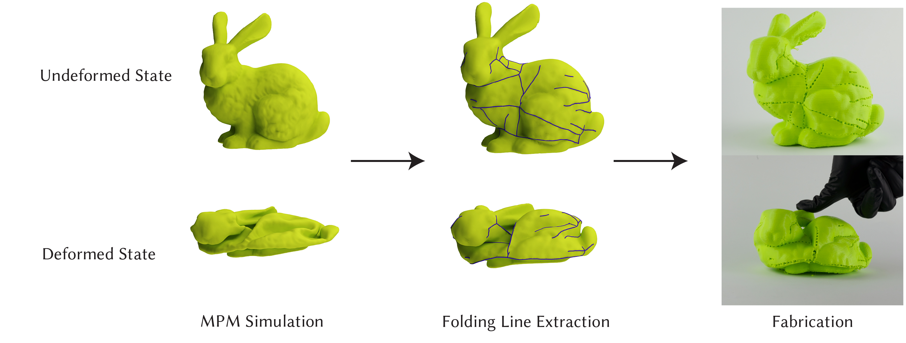

# Discovering Folding Lines for Surface Compression
This is the code of the SIGGRAPH paper "Discovering Folding Lines for Surface Compression"


## Installation
### Prerequisites
- System: The code is tested on MacOS
- Python Library: Taichi

## How to run
**Clone**
Clone the repository
``` 
git clone --recursive https://github.com/Toshiki67/Discovering_Folding_Lines_for_Surface_Compression.git
```
**Run MPM simulation**
In order to run Material Point Method(MPM) simulation, 
```
cd python
python mpm.py <your file path>
# for example 
python mpm.py ../model/bunny.obj
```
And press continue button.
**Run FLE**
If you would like to run the FLE code and visualization code, you need to build.
```
mkdir build
cd build
cmake ..
make -j8
```
In order to run Folding Line Extraction(FLE),
```
./FLE -u <undeformed mesh file path> -r <reference mesh file path> -d <deformed mesh file path> -s <delta value, 6 means 1e-6>
// for example
/FLE -u ../results/bunny_1/0.obj -r ../results/bunny_1/0.obj -d ../results/bunny_1/280.obj -s 6
```
With this FLE, the code automatically make a folder that store the result with iteration number. For example, deformed_1000.obj, undeformed_1000.obj.
After FLE, if you want to visualize the result,
```
./visualization  -f <folder that are made by FLE> -r <reference mesh file path> -s <delta value, 6 means 1e-6> -b <number that specify file of iteration of FLE>
// for example
./visualization -f ../results/bunny_1 -r ../results/bunny_1/undeformed_0.obj -s 6 -b 200000
```
